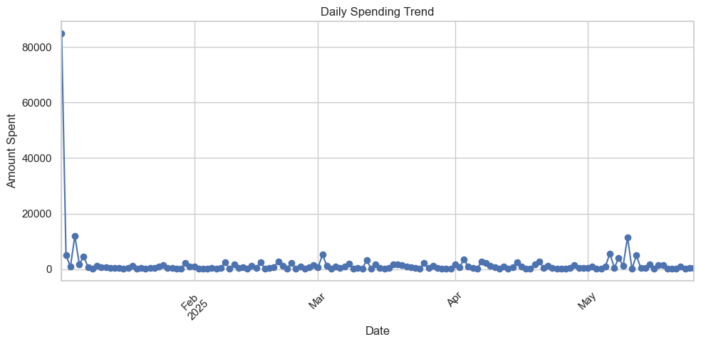

# Kharcha-Tracker
A simple Jupyter Notebook project to track and visualize monthly expenses using Python.

```
Hey there! 👋 I'm Aditi, a B.Tech 3rd year student, and this is my very first Jupyter Notebook project! As a typical college student juggling between Bangalore (home) and college, I realized I had absolutely no idea where my money was going each month. Sound familiar? 

So I decided to take matters into my own hands and track every single expense from January to May 2025 - from those expensive semester fees at BIT Mesra to late-night Domino's orders during exam prep!
```

## Features
- Analyze total spending
- Category-wise breakdown (Food, Transport, etc.)
- Daily spending trends
- Pie charts & line plots

## How to Use
1. Add your data to `data/expenses.csv`
2. Open `notebook/expense_analysis.ipynb`
3. Run all cells and explore the insights!

## Sample Output




## How to Explore My Financial Chaos

1. **Check out my data**: `data/expenses.csv` - 5 months of brutal honesty about my spending
2. **Open the notebook**: `notebook/expense_analysis.ipynb` 
3. **Run all cells** and witness the beautiful disaster that is a college student's budget!


## 🛠️ Tech Stack I Learned

- **Python** - My new best friend for data analysis
- **Jupyter Notebook** - Where the magic happens
- **Pandas** - For wrestling with my messy expense data
- **Matplotlib & Seaborn** - Making my spending look pretty (even when it's not)


## 🤝 Connect With Me

If you're also a student trying to make sense of your finances, or if this is your first data project too, I'd love to connect! Feel free to fork this repo and adapt it for your own expense tracking journey.

*PS: Yes, I really did spend ₹850 on Starbucks for a birthday treat. No regrets! ☕*

---

**Made with ❤️ and a lot of financial anxiety by a B.Tech student who finally learned where her money goes!**